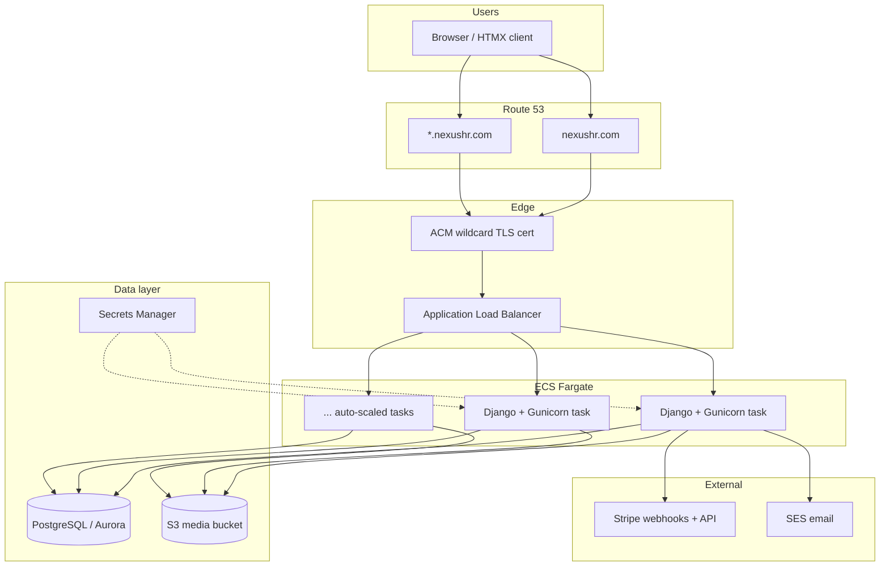

# NexusHR — SST Deployment on AWS

This document describes how to deploy **NexusHR** (Django 5 multi-tenant HR SaaS) to AWS using [SST v3 (Ion)](https://sst.dev). It covers **staging** and **production** environments, horizontal scaling, and the operational workflows needed to run the app reliably.

---

## Table of contents

1. [Goals](#goals)
2. [Architecture overview](#architecture-overview)
3. [Environments](#environments)
4. [Prerequisites](#prerequisites)
5. [Project layout](#project-layout)
6. [Reference infrastructure (`sst.config.ts`)](#reference-infrastructure-sstconfigts)
7. [Environment variables](#environment-variables)
8. [Multi-tenant DNS and TLS](#multi-tenant-dns-and-tls)
9. [Scaling strategy](#scaling-strategy)
10. [Media and static files](#media-and-static-files)
11. [Database and migrations](#database-and-migrations)
12. [Secrets and Stripe](#secrets-and-stripe)
13. [CI/CD](#cicd)
14. [Deployment workflows](#deployment-workflows)
15. [Operations runbook](#operations-runbook)
16. [Cost guidance](#cost-guidance)
17. [Security checklist](#security-checklist)
18. [Implementation phases](#implementation-phases)

---

## Goals

| Goal | Approach |
|------|----------|
| Two isolated environments | SST **stages**: `staging`, `production` |
| Containerized Django app | Existing `Dockerfile` → ECS Fargate via `sst.aws.Service` |
| Managed PostgreSQL | `sst.aws.Postgres` (or Aurora Serverless v2 for production scale) |
| Wildcard subdomains | ACM wildcard cert + ALB + Route 53 `*.domain` |
| Horizontal scale | ECS service auto-scaling on CPU/memory/request count |
| Safe rollouts | GitHub Actions → `sst deploy --stage <stage>` |
| Tenant file uploads | S3 bucket (replace ephemeral container disk) |

---

## Architecture overview

NexusHR uses **subdomain multi-tenancy** (`acme.nexushr.com` → tenant `acme`). The marketing site lives on the apex domain (`nexushr.com`). All tenant traffic must reach the same Django service with a valid wildcard TLS certificate.



**Why ALB over API Gateway:** NexusHR is a traditional server-rendered Django app (sessions, CSRF, HTMX partials). An Application Load Balancer is the right default for long-lived HTTP connections and cookie-based auth at scale.

---

## Environments

SST stages map 1:1 to environments. Each stage provisions a **fully isolated** stack (VPC, cluster, database, secrets).

| | Staging | Production |
|---|---------|------------|
| **SST stage** | `staging` | `production` |
| **Apex domain** | `staging.nexushr.com` | `nexushr.com` |
| **Tenant pattern** | `{tenant}.staging.nexushr.com` | `{tenant}.nexushr.com` |
| **Stripe** | Test mode keys | Live mode keys |
| **ECS capacity** | Fargate Spot (cost savings) | Fargate on-demand (stability) |
| **Min tasks** | 1 | 2 (HA across AZs) |
| **Max tasks** | 4 | 16+ |
| **Database** | `sst.aws.Postgres` (small) | Aurora Serverless v2 or larger RDS |
| **Backups** | 7-day retention | 30-day retention + PITR |
| **Debug** | `DJANGO_DEBUG=false` (still off) | `DJANGO_DEBUG=false` |

> **Note:** Tenant subdomains like `staging` are [reserved in code](../tenancy/utils.py) and cannot be used as customer workspaces. Using `staging.nexushr.com` as the environment apex avoids collisions with tenant slugs.

### Stage naming in SST

```bash
sst deploy --stage staging      # deploy staging
sst deploy --stage production   # deploy production
sst remove --stage staging      # tear down staging (careful!)
```

---

## Prerequisites

### AWS account

- One AWS account (recommended) with separate SST stages, **or** two accounts with SST `providers` per stage.
- IAM permissions for VPC, ECS, ECR, RDS, ALB, ACM, Route 53, S3, Secrets Manager, CloudWatch Logs.
- AWS CLI configured (`aws configure` or OIDC in CI).

### Domain

- Register `nexushr.com` (or your domain) in Route 53, or delegate DNS to Route 53.
- Plan hosted zones:
  - Production: `nexushr.com`
  - Staging: `staging.nexushr.com` (separate hosted zone or subdomain delegation)

### Local tooling

```bash
# Node.js 20+ (for SST)
curl -fsSL https://sst.dev/install | bash

# Verify
sst version

# Python 3.12 (app runtime — already in Dockerfile)
python --version
```

### Bootstrap (one-time per account/region)

```bash
cd infra
npm install
sst bootstrap --stage staging
sst bootstrap --stage production
```

---

## Project layout

Add an `infra/` directory alongside the Django app:

```
nexushr/
├── accounts/
├── hrms/
├── Dockerfile              # existing — used by SST Service
├── docker-compose.yml      # local dev only
├── docs/
│   └── sst-deployment.md   # this file
└── infra/
    ├── package.json
    ├── sst.config.ts       # infrastructure definition
    ├── tsconfig.json
    └── stages/
        ├── staging.ts      # stage-specific overrides
        └── production.ts
```

Install SST in `infra/`:

```bash
mkdir -p infra/stages
cd infra
npm init -y
npm install sst@latest @pulumi/aws
```

---

## Reference infrastructure (`sst.config.ts`)

The following is a **reference** SST config tailored to NexusHR. Adjust instance sizes, scaling bounds, and domains for your traffic profile.

```typescript
/// <reference path="./.sst/platform/config.d.ts" />

const stage = $app.stage;

const isProduction = stage === "production";

const config = isProduction
  ? {
      domain: "nexushr.com",
      tenantBaseDomain: "nexushr.com",
      minTasks: 2,
      maxTasks: 16,
      cpu: "1 vCPU" as const,
      memory: "2 GB" as const,
      capacity: "on-demand" as const,
      dbScaling: { min: "0.5 ACU", max: "8 ACU" },
    }
  : {
      domain: "staging.nexushr.com",
      tenantBaseDomain: "staging.nexushr.com",
      minTasks: 1,
      maxTasks: 4,
      cpu: "0.25 vCPU" as const,
      memory: "0.5 GB" as const,
      capacity: "spot" as const,
      dbScaling: { min: "0.5 ACU", max: "2 ACU" },
    };

export default $config({
  app(input) {
    return {
      name: "nexushr",
      removal: isProduction ? "retain" : "remove",
      protect: isProduction,
      home: "aws",
    };
  },
  async run() {
    const vpc = new sst.aws.Vpc("Vpc", { nat: "managed" });

    const mediaBucket = new sst.aws.Bucket("Media", {
      access: "cloudfront", // or "private" with IAM via link
    });

    const database = new sst.aws.Postgres("Database", {
      vpc,
      scaling: config.dbScaling,
    });

    const cluster = new sst.aws.Cluster("Cluster", { vpc });

    const djangoSecret = new sst.Secret("DjangoSecretKey");
    const stripeSecret = new sst.Secret("StripeSecretKey");
    const stripeWebhook = new sst.Secret("StripeWebhookSecret");

    const service = new sst.aws.Service("Web", {
      cluster,
      cpu: config.cpu,
      memory: config.memory,
      capacity: config.capacity,
      image: {
        context: "..",
        dockerfile: "../Dockerfile",
      },
      link: [database, mediaBucket, djangoSecret, stripeSecret, stripeWebhook],
      environment: {
        DJANGO_SETTINGS_MODULE: "hrms.settings.production",
        DJANGO_DEBUG: "false",
        DJANGO_ALLOWED_HOSTS: [
          config.domain,
          `*.${config.domain}`,
          `.${config.domain}`,
        ].join(","),
        TENANT_BASE_DOMAIN: config.tenantBaseDomain,
        TENANT_URL_SCHEME: "https",
        TENANT_PORT: "",
        CSRF_TRUSTED_ORIGINS: `https://${config.domain},https://*.${config.domain}`,
        SESSION_COOKIE_DOMAIN: `.${config.tenantBaseDomain}`,
        SECURE_SSL_REDIRECT: "true",
        AWS_STORAGE_BUCKET_NAME: mediaBucket.name,
        EMAIL_BACKEND: "django.core.mail.backends.smtp.EmailBackend",
        EMAIL_HOST: "email-smtp.us-east-1.amazonaws.com",
        EMAIL_PORT: "587",
        EMAIL_USE_TLS: "true",
      },
      loadBalancer: {
        domain: {
          name: config.domain,
          aliases: [`*.${config.domain}`],
          dns: sst.aws.dns(),
        },
        rules: [{ listen: "443/https", forward: "8000/http" }],
        health: {
          path: "/",
          interval: "30 seconds",
          timeout: "5 seconds",
        },
      },
      scaling: {
        min: config.minTasks,
        max: config.maxTasks,
        cpuUtilization: 60,
        memoryUtilization: 70,
      },
      transform: {
        taskDefinition: (args) => {
          // Run migrations before serving traffic on new tasks
          args.containerDefinitions = $resolve(args.containerDefinitions).apply(
            (defs) =>
              defs.map((def) => ({
                ...def,
                command: [
                  "sh",
                  "-c",
                  "python manage.py migrate --noinput && " +
                    "python manage.py seed_plans && " +
                    "gunicorn hrms.wsgi:application --bind 0.0.0.0:8000 " +
                    "--workers ${GUNICORN_WORKERS:-3} " +
                    "--timeout 120 --max-requests 1000 --max-requests-jitter 50",
                ],
              })),
          );
        },
      },
    });

    return {
      url: service.url,
      database: database.host,
      mediaBucket: mediaBucket.name,
    };
  },
});
```

### Key design decisions

1. **Single service, many subdomains** — Django's `TenantMiddleware` resolves tenants from the `Host` header. The ALB forwards all `*.nexushr.com` traffic to the same ECS service.
2. **Migrations on task start** — Matches `docker-compose.yml` behavior. For zero-downtime deploys at scale, move migrations to a one-off ECS task in CI (see [Database and migrations](#database-and-migrations)).
3. **Linked resources** — SST `link` injects DB credentials and bucket names into the container environment and IAM policies automatically.
4. **`removal: retain` in production** — Prevents accidental deletion of RDS and S3 on `sst remove`.

---

## Environment variables

Map these from SST secrets, linked resources, or plain environment config.

| Variable | Staging | Production | Source |
|----------|---------|------------|--------|
| `DJANGO_SETTINGS_MODULE` | `hrms.settings.production` | same | SST `environment` |
| `DJANGO_SECRET_KEY` | random | unique | `sst.Secret` |
| `DJANGO_DEBUG` | `false` | `false` | SST `environment` |
| `DJANGO_ALLOWED_HOSTS` | `staging.nexushr.com,*.staging.nexushr.com` | `nexushr.com,*.nexushr.com` | SST `environment` |
| `TENANT_BASE_DOMAIN` | `staging.nexushr.com` | `nexushr.com` | SST `environment` |
| `TENANT_URL_SCHEME` | `https` | `https` | SST `environment` |
| `TENANT_PORT` | *(empty)* | *(empty)* | SST `environment` |
| `CSRF_TRUSTED_ORIGINS` | `https://staging.nexushr.com,https://*.staging.nexushr.com` | `https://nexushr.com,https://*.nexushr.com` | SST `environment` |
| `SESSION_COOKIE_DOMAIN` | `.staging.nexushr.com` | `.nexushr.com` | SST `environment` |
| `DB_HOST` / `DB_NAME` / `DB_USER` / `DB_PASSWORD` | auto | auto | `link: [database]` |
| `STRIPE_SECRET_KEY` | `sk_test_...` | `sk_live_...` | `sst.Secret` per stage |
| `STRIPE_PUBLISHABLE_KEY` | `pk_test_...` | `pk_live_...` | `sst.Secret` or env |
| `STRIPE_WEBHOOK_SECRET` | `whsec_...` (test endpoint) | `whsec_...` (live endpoint) | `sst.Secret` per stage |
| `GUNICORN_WORKERS` | `3` | `2 × vCPU + 1` | env (scale with task size) |
| `AWS_STORAGE_BUCKET_NAME` | bucket name | bucket name | `link: [mediaBucket]` |

Set secrets per stage:

```bash
cd infra
sst secret set DjangoSecretKey "$(openssl rand -base64 48)" --stage staging
sst secret set StripeSecretKey "sk_test_..." --stage staging
sst secret set StripeWebhookSecret "whsec_..." --stage staging

sst secret set DjangoSecretKey "$(openssl rand -base64 48)" --stage production
sst secret set StripeSecretKey "sk_live_..." --stage production
sst secret set StripeWebhookSecret "whsec_..." --stage production
```

---

## Multi-tenant DNS and TLS

NexusHR requires:

| Record | Purpose |
|--------|---------|
| `nexushr.com` | Marketing site, signup, Stripe checkout return URLs |
| `*.nexushr.com` | Per-tenant workspaces (`acme.nexushr.com`) |

### ACM certificate

Request (or let SST manage) a certificate covering:

- `nexushr.com`
- `*.nexushr.com`

For staging, use `staging.nexushr.com` and `*.staging.nexushr.com`.

SST's `loadBalancer.domain` with `aliases: ["*.nexushr.com"]` handles ACM validation and Route 53 alias records when DNS is on Route 53.

### Stripe webhooks

Register **separate** webhook endpoints per environment:

| Environment | Endpoint URL |
|-------------|--------------|
| Staging | `https://staging.nexushr.com/billing/webhook/` |
| Production | `https://nexushr.com/billing/webhook/` |

Tenant-specific Stripe callbacks still route through the apex domain for webhooks (not per-tenant subdomains).

### Health checks

Point the ALB health check at a path that returns `200` without requiring a tenant context. Options:

- Add a lightweight `/healthz/` view in Django (recommended).
- Use `/` on the apex domain (marketing site).

---

## Scaling strategy

### Application tier (ECS Fargate)

| Signal | Staging | Production | Action |
|--------|---------|------------|--------|
| CPU utilization | 60% | 60% | Scale out ECS tasks |
| Memory utilization | 70% | 70% | Scale out ECS tasks |
| Min tasks | 1 | 2 | HA in production |
| Max tasks | 4 | 16 (raise as needed) | Upper bound |

**Gunicorn workers per task:** Use `(2 × vCPU) + 1` workers. A 1 vCPU task → 3 workers (matches the current Dockerfile default).

```bash
# Example: 1 vCPU Fargate task
GUNICORN_WORKERS=3
```

**When to scale up task size vs task count:**

- **More tasks** — Better for HA, rolling deploys, and absorbing traffic spikes.
- **Larger tasks** — Better when connection pools to Postgres become a bottleneck; keep total workers across all tasks below Postgres `max_connections`.

### Database tier

| Phase | Staging | Production |
|-------|---------|------------|
| Launch | `sst.aws.Postgres` | `sst.aws.Postgres` or Aurora Serverless v2 |
| Growth | Fixed small instance | Aurora ACU auto-scale (0.5 → 8+ ACU) |
| High read load | — | Add read replica; route reports to replica |

Connection pooling: add **PgBouncer** as a sidecar or use RDS Proxy when ECS task count exceeds ~10.

### Caching (future)

Not required at launch. When session or query load grows:

- **ElastiCache Redis** for Django sessions and cache framework.
- **CloudFront** in front of the ALB for cacheable static responses (Whitenoise already serves compressed static files from the container).

### Scheduled work

For future cron needs (payroll runs, report emails), use **EventBridge → ECS RunTask** with the same Docker image and `python manage.py <command>`.

---

## Media and static files

### Static files (current)

Production settings use **WhiteNoise** with `CompressedManifestStaticFilesStorage`. Static assets are baked into the Docker image at build time (`collectstatic` in `Dockerfile`). No S3/CDN change required for v1.

### Media uploads (required for AWS)

The app stores uploads on local disk (`FileSystemStorage`). Fargate tasks use **ephemeral storage** — files are lost on redeploy.

**Required change for AWS:** switch `default` storage to S3 (e.g. `django-storages[s3]`).

```python
# hrms/settings/production.py (future addition)
STORAGES = {
    "default": {
        "BACKEND": "storages.backends.s3boto3.S3Boto3Storage",
    },
    "staticfiles": {
        "BACKEND": "whitenoise.storage.CompressedManifestStaticFilesStorage",
    },
}
```

SST `link: [mediaBucket]` grants the ECS task IAM permissions to read/write the bucket.

---

## Database and migrations

### Initial deploy

1. `sst deploy --stage staging` — provisions VPC, RDS, ECS.
2. ECS tasks run `migrate` and `seed_plans` on startup (see reference config).

### Zero-downtime migrations (production)

For breaking schema changes at scale:

1. Deploy code that is **backward compatible** with the old schema.
2. Run migrations as a **one-off ECS task** before updating the service:

```bash
aws ecs run-task \
  --cluster nexushr-production-Cluster \
  --task-definition nexushr-production-Web \
  --overrides '{"containerOverrides":[{"name":"Web","command":["python","manage.py","migrate","--noinput"]}]}'
```

3. Roll the service to the new image.

### Backups

- Enable automated RDS backups (staging: 7 days, production: 30 days).
- Test restore quarterly in staging.

---

## Secrets and Stripe

| Secret | Rotation |
|--------|----------|
| `DJANGO_SECRET_KEY` | Rotate manually; invalidates sessions |
| `STRIPE_*` | Rotate in Stripe dashboard; update via `sst secret set` |
| DB password | Managed by SST/RDS; rotated via AWS |

Never commit secrets. Use `sst secret` for stage-scoped values and GitHub Actions OIDC for deploy credentials.

---

## CI/CD

Extend `.github/workflows/ci.yml` with deploy jobs that run **after** lint and test pass.

```yaml
# .github/workflows/deploy.yml
name: Deploy

on:
  push:
    branches: [main]

concurrency:
  group: deploy-${{ github.ref }}
  cancel-in-progress: false

jobs:
  test:
    # ... reuse existing lint + test jobs ...

  deploy-staging:
    needs: test
    runs-on: ubuntu-latest
    permissions:
      id-token: write
      contents: read
    steps:
      - uses: actions/checkout@v4
      - uses: actions/setup-node@v4
        with:
          node-version: "20"
      - uses: aws-actions/configure-aws-credentials@v4
        with:
          role-to-assume: ${{ secrets.AWS_DEPLOY_ROLE_ARN }}
          aws-region: us-east-1
      - run: curl -fsSL https://sst.dev/install | bash
      - run: npm ci
        working-directory: infra
      - run: sst deploy --stage staging
        working-directory: infra

  deploy-production:
    needs: deploy-staging
    if: github.ref == 'refs/heads/main'
    runs-on: ubuntu-latest
    environment: production   # GitHub environment protection rules
    permissions:
      id-token: write
      contents: read
    steps:
      - uses: actions/checkout@v4
      - uses: actions/setup-node@v4
        with:
          node-version: "20"
      - uses: aws-actions/configure-aws-credentials@v4
        with:
          role-to-assume: ${{ secrets.AWS_PRODUCTION_DEPLOY_ROLE_ARN }}
          aws-region: us-east-1
      - run: curl -fsSL https://sst.dev/install | bash
      - run: npm ci
        working-directory: infra
      - run: sst deploy --stage production
        working-directory: infra
```

### Promotion flow

```
PR → CI (lint + test)
  → merge to main
    → auto deploy staging
      → manual approval (GitHub `production` environment)
        → deploy production
```

---

## Deployment workflows

### First-time setup

```bash
# 1. Install infra dependencies
cd infra && npm install

# 2. Set secrets
sst secret set DjangoSecretKey "$(openssl rand -base64 48)" --stage staging
# ... other secrets ...

# 3. Deploy staging
sst deploy --stage staging

# 4. Verify
curl -I https://staging.nexushr.com/
curl -I https://demo.staging.nexushr.com/   # after seeding a demo tenant
```

### Routine deploy

```bash
cd infra
sst deploy --stage staging      # verify
sst deploy --stage production   # promote
```

### Rollback

```bash
# Redeploy a previous git SHA
git checkout <previous-sha>
cd infra && sst deploy --stage production
```

ECS rolling deployments keep old tasks alive until new ones pass health checks.

### Local dev against staging DB (debug only)

```bash
sst tunnel --stage staging   # port-forward to RDS (use with caution)
```

---

## Operations runbook

| Task | Command / location |
|------|-------------------|
| View logs | CloudWatch → `/ecs/nexushr-<stage>-Web` |
| Shell into container | `aws ecs execute-command` (enable ECS Exec on the service) |
| Django admin | `https://nexushr.com/admin/` (superuser via `createsuperuser`) |
| Scale manually | Update `scaling.max` in `sst.config.ts` and redeploy |
| Stripe webhook failures | Stripe dashboard → Webhooks → event log |
| Database connect | SST outputs or Secrets Manager |

### Alerts (recommended)

- ALB 5xx rate > 1% for 5 minutes
- ECS CPU > 80% for 10 minutes
- RDS free storage < 20%
- RDS connection count > 80% of max

Wire alerts to Slack/PagerDuty via CloudWatch Alarms → SNS.

---

## Cost guidance

Approximate monthly costs (us-east-1, low traffic):

| Resource | Staging | Production |
|----------|---------|------------|
| ECS Fargate (1–2 tasks) | ~$15–30 | ~$60–120 |
| RDS / Aurora Serverless | ~$15–40 | ~$50–200 |
| ALB | ~$20 | ~$20 |
| NAT Gateway | ~$35 | ~$35 |
| S3 + data transfer | ~$5 | ~$10–50 |
| **Total** | **~$90–130** | **~$175–425** |

Costs scale with task count, ACU, and egress. Fargate Spot in staging saves ~50% on compute.

---

## Security checklist

- [ ] `DJANGO_DEBUG=false` in all deployed environments
- [ ] Unique `DJANGO_SECRET_KEY` per stage
- [ ] Wildcard TLS cert auto-renewed via ACM
- [ ] RDS in private subnets (no public accessibility)
- [ ] ECS tasks in private subnets; only ALB is public
- [ ] S3 bucket blocks public access; access via IAM role
- [ ] `SECURE_SSL_REDIRECT=true`, secure session/CSRF cookies (already in `production.py`)
- [ ] GitHub OIDC for CI — no long-lived AWS access keys
- [ ] Production deploy requires manual approval
- [ ] Stripe webhook signature verification enabled (`STRIPE_WEBHOOK_SECRET`)
- [ ] VPC flow logs enabled for production

---

## Implementation phases

### Phase 1 — Staging MVP

- [ ] Add `infra/` with `sst.config.ts`
- [ ] Deploy staging with Postgres + ECS + ALB
- [ ] Configure `staging.nexushr.com` DNS and TLS
- [ ] Add `/healthz/` endpoint for ALB checks
- [ ] Verify signup, login, tenant subdomain routing

### Phase 2 — Production readiness

- [ ] S3 media storage (`django-storages`)
- [ ] SES for transactional email
- [ ] Production secrets and Stripe live mode
- [ ] GitHub Actions deploy workflow with approval gate
- [ ] CloudWatch alarms

### Phase 3 — Scale

- [ ] ECS auto-scaling tuned on real traffic
- [ ] Aurora Serverless v2 with higher ACU ceiling
- [ ] RDS Proxy or PgBouncer
- [ ] Redis for sessions/cache
- [ ] Separate migration task in CI (zero-downtime deploys)

---

## Related project files

| File | Role |
|------|------|
| [`Dockerfile`](../Dockerfile) | Container image (Python 3.12, Gunicorn, collectstatic) |
| [`docker-compose.yml`](../docker-compose.yml) | Local production-like stack |
| [`hrms/settings/production.py`](../hrms/settings/production.py) | Production Django settings |
| [`hrms/settings/base.py`](../hrms/settings/base.py) | Tenant, Stripe, CSRF config |
| [`tenancy/utils.py`](../tenancy/utils.py) | Subdomain parsing and reserved names |
| [`.env.example`](../.env.example) | Local environment variable reference |

---

## References

- [SST Service component](https://sst.dev/docs/component/aws/service/)
- [SST Postgres component](https://sst.dev/docs/component/aws/postgres/)
- [SST Stages](https://sst.dev/docs/reference/cli#stage)
- [SST Secrets](https://sst.dev/docs/component/secret/)
- [Django deployment checklist](https://docs.djangoproject.com/en/5.0/howto/deployment/checklist/)
